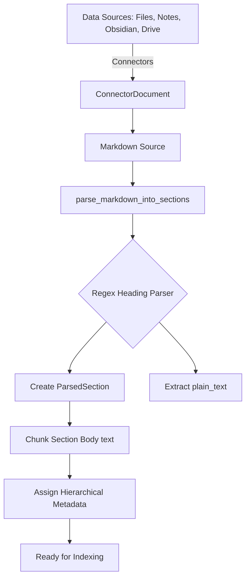
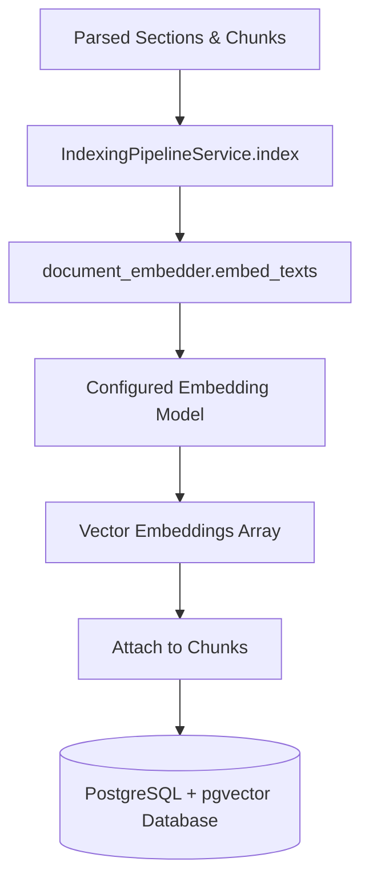
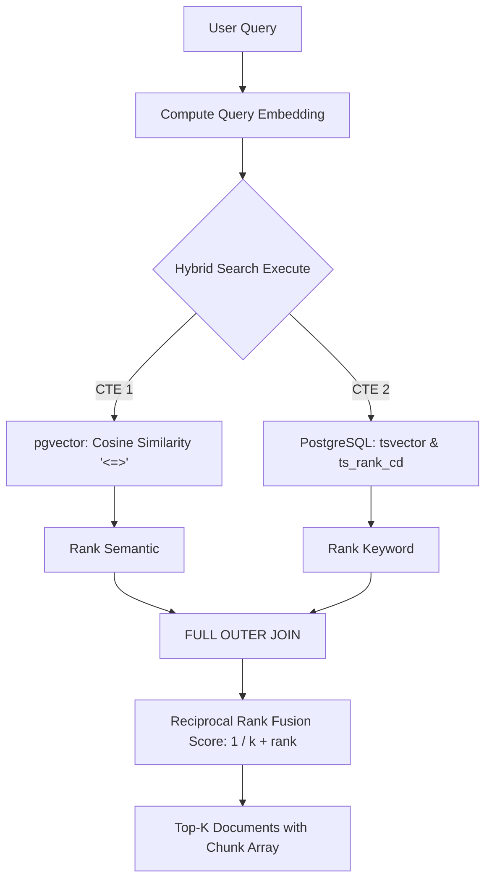
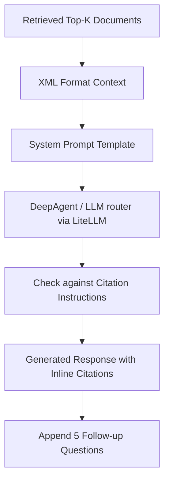

# 3.6. Xây dựng hệ thống Hybrid RAG

Dựa trên quá trình phân tích source code thực tế của module RAG (Retrieval-Augmented Generation) thuộc hệ thống (`nbd_backend`), dưới đây là báo cáo chi tiết về kiến trúc luồng dữ liệu thông qua 4 giai đoạn: Ingestion, Indexing, Retrieval và Generation.

---

## 1. Data Ingestion Pipeline

Giai đoạn Data Ingestion chịu trách nhiệm tiếp nhận, tiền xử lý và phân tách dữ liệu thành các đoạn nhỏ (chunks) nhằm tối ưu hóa việc trích xuất và tìm kiếm sau này.

**Truy vết từ Source Code:**
1. **Nguồn dữ liệu:** Dữ liệu được thu thập từ các Connectors (các ứng dụng tích hợp) và đóng gói vào cấu trúc `ConnectorDocument` (`app/indexing_pipeline/connector_document.py`). Các nguồn chính bao gồm: EXTENSION, FILE, YOUTUBE_VIDEO, GOOGLE_DRIVE_FILE, NOTE, OBSIDIAN_CONNECTOR (`app/db.py`).
2. **Định dạng và Thư viện:** Tất cả tài liệu đầu vào được đồng nhất thành định dạng Markdown (`source_markdown`). Việc phân tách được thực hiện không thông qua thư viện bên ngoài mà qua module tự phát triển: `document_chunker.py`.
3. **Tiền xử lý (Preprocessing):** Sử dụng các biểu thức chính quy (Regex) nhẹ (`_strip_markdown`) để loại bỏ định dạng Markdown không cần thiết (như dấu `#`, `*`, code block, link markdown) nhưng vẫn giữ lại cấu trúc phân cấp.
4. **Chunking Strategy:** Áp dụng chiến lược "Section-aware chunking" (Phân mảnh nhận thức theo vùng). Dữ liệu được phân tích thành cây phân cấp thông qua hàm `parse_markdown_into_sections` bằng thuật toán dựa trên stack để theo dõi độ sâu (depth) của các thẻ Heading (`#`, `##`, v.v.).
5. **Metadata được lưu trữ:**
   * Cấp độ Section (`DocumentSection`): `heading_text`, `heading_level`, `section_type` (Heuristic classification thành: title, chapter, introduction, conclusion, reference, section).
   * Cấp độ Chunk (`Chunk`): `chunk_order_in_section`, `chunk_metadata`, `content_hash` để phục vụ chống trùng lặp.

**Sơ đồ Ingestion Pipeline:**

---

## 2. Indexing Pipeline

Sau khi dữ liệu được phân mảnh, các Chunk sẽ được nhúng (embed) và lập chỉ mục trong cơ sở dữ liệu Vector để có thể truy vấn ngữ nghĩa.

**Truy vết từ Source Code:**
1. **Quá trình thực thi:** Hàm `index()` trong `app/indexing_pipeline/indexing_pipeline_service.py` điều phối toàn bộ việc tính toán Vector. Nó thu thập toàn bộ body text từ các chunk và gọi `embed_texts()` (`app/indexing_pipeline/document_embedder.py`).
2. **Embedding Model & Dimension:** Tham số dimension được cấu hình linh hoạt thông qua cấu hình toàn cục `config.embedding_model_instance.dimension` (File `app/db.py`).
3. **Lưu trữ (Vector DB):** Hệ thống không sử dụng các dịch vụ Vector ngoài như Chroma hay Redis mà sử dụng trực tiếp **PostgreSQL kết hợp với pgvector**.
4. **Mô hình Dữ liệu:**
   * Table `documents`: Chứa `embedding = Column(Vector(config.embedding_model_instance.dimension))` dành cho summary vector.
   * Table `chunks`: Chứa cột `embedding = Column(Vector(...))` dùng để biểu diễn vector đặc trưng của từng đoạn văn bản.

**Sơ đồ Indexing Pipeline:**

---

## 3. Retrieval Pipeline

Phần cốt lõi tạo nên Hybrid RAG chính là khả năng truy xuất kết hợp (Hybrid Search) tại hàm `hybrid_search` (file `app/retriever/chunks_hybrid_search.py`).

**Truy vết từ Source Code:**
1. **Luồng Truy vấn:** Câu hỏi (Query) được đẩy từ Tool Agent (`search_knowledge_base`) xuống `ConnectorService._combined_rrf_search` và cuối cùng xử lý tại `chunks_hybrid_search.py`.
2. **Dense Retrieval (Semantic Search):**
   * Hoạt động dựa trên độ tương đồng Cosine của Vector nhúng.
   * Cú pháp SQL: Sử dụng toán tử `<=>` của pgvector: `Chunk.embedding.op("<=>")(query_embedding)`.
3. **Sparse Retrieval (Keyword Search):**
   * Dùng tính năng Full-Text Search gốc của PostgreSQL (Tích hợp thuật toán tương đồng với BM25).
   * Tạo vector tìm kiếm văn bản: `func.to_tsvector("english", Chunk.content)`.
   * Lấy điểm xếp hạng văn bản: `func.ts_rank_cd(tsvector, tsquery)`.
4. **Hybrid Search Scoring (RRF - Reciprocal Rank Fusion):**
   * Áp dụng thuật toán RRF để hòa trộn kết quả. Trong source code thể hiện rõ việc sử dụng CTE (Common Table Expressions) để kết hợp hai luồng kết quả với công thức: `1.0 / (k + semantic_rank) + 1.0 / (k + keyword_rank)`. Hằng số phạt `k = 60`.

**Sơ đồ Retrieval Pipeline:**

---

## 4. Generation Pipeline

Đóng vai trò tổng hợp (Synthesis) thông tin dựa trên ngữ cảnh đã trích xuất, hỗ trợ chuyên biệt cho các quyết định lâm sàng.

**Truy vết từ Source Code:**
1. **Mô hình LLM:** Hệ thống sử dụng LiteLLM (`app/db.py` - `LiteLLMProvider`) cho phép định tuyến động tới đa dạng LLM như OPENAI, ANTHROPIC, GOOGLE, OLLAMA, GROQ, v.v.
2. **Quản lý Prompt Context:** File `app/agents/new_chat/system_prompt.py`. Khối lệnh `NFD_SYSTEM_INSTRUCTIONS` áp đặt quy tắc giao tiếp như một chuyên gia tư vấn y khoa (ví dụ: quan sát → chẩn đoán sơ bộ → chẩn đoán phân biệt → đề xuất điều trị). Cố định theo form chuẩn định dạng LaTeX.
3. **Cơ chế Truyền Context:** Dữ liệu Retrieval (chunks) được định dạng theo cấu trúc tag XML (`<chunk id='123'>...`) bởi hàm `format_documents_for_context` (`app/agents/new_chat/tools/document_search_base.py`).
4. **Citation (Trích dẫn bắt buộc):** Hệ thống cấu hình quy tắc chống sinh ảo ảnh (`NFD_CITATION_INSTRUCTIONS`), ép LLM chỉ được phép cung cấp thông tin nếu có thẻ trích dẫn chính xác định dạng `[citation:chunk_id]`. Cấm chèn hyperlink Markdown tự do. Mọi Fact phải đi kèm Source ID.

**Sơ đồ Generation Pipeline:**

---

## 5. Trace End-to-End Execution (Truy vết luồng thực tế)

Ví dụ thực thi một Query: *"What is the current treatment protocol for community-acquired pneumonia?"*

1. **User Query**
   ↓ `app/agents/new_chat/chat_deepagent.py :: create_nfd_deep_agent`
2. **Agent Reasoning:** LLM quyết định câu hỏi mang tính lâm sàng (Clinical) → Gọi Tool `search_knowledge_base`.
   ↓ `app/agents/new_chat/tools/knowledge_base.py :: search_knowledge_base_async`
3. **Routing Query:** Xác định các Connector hợp lệ (Ví dụ: FILE, OBSIDIAN, COMPOSIO) và kiểm tra tính hợp lệ của query.
   ↓ `app/indexing_pipeline/document_embedder.py :: embed`
4. **Query Embedding:** Tạo vector cho từ khóa.
   ↓ `app/retriever/chunks_hybrid_search.py :: ChucksHybridSearchRetriever.hybrid_search`
5. **Database Execution:** Kết hợp Postgres Vector Search (Semantic) và Text Search (Keyword BM25), tính tổng bằng RRF (k=60), trích xuất Top-K.
   ↓ `app/agents/new_chat/tools/document_search_base.py :: format_documents_for_context`
6. **Context Formulation:** Bọc văn bản tìm được trong thẻ `<document_content>` chứa `<chunk id="...">`.
   ↓ `app/agents/new_chat/system_prompt.py :: NFD_SYSTEM_INSTRUCTIONS + NFD_CITATION_INSTRUCTIONS`
7. **Synthesis:** LiteLLM nhận chuỗi Context kèm System Prompt, sinh ra nội dung giải đáp.
8. **Final Response:** Gửi câu trả lời định dạng Markdown có trích dẫn `[citation:102]`, kết thúc bằng danh sách *### Suggested Clinical Follow-up Questions*.
