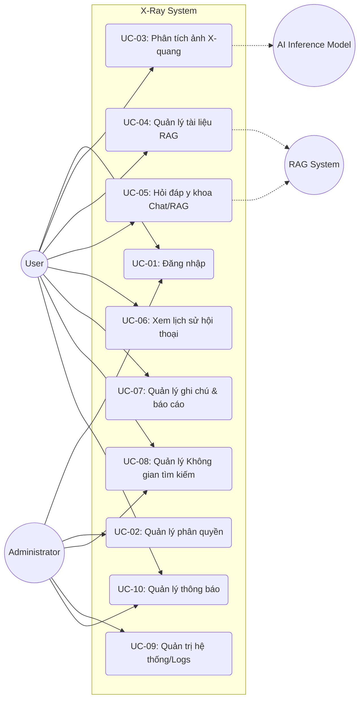

# Chương 2: Phân tích và thiết kế hệ thống

## 2.1. Phân tích toàn bộ hệ thống (Từ Source Code)

Dựa trên cấu trúc thư mục, các module FastAPI và các service, hệ thống được chia thành các module chính với chức năng tương ứng:

| Module | Chức năng (Tìm thấy trong Source Code) |
|---|---|
| **Auth** | Xác thực OAuth/JWT (`celery_app.py`, `rbac_routes.py`, `auth_routes.py`), Quản lý tài khoản và phân quyền người dùng (`users.py`, roles, permissions). |
| **Analysis** | Phân tích ảnh X-quang y tế (`image_inference_service.py`), tạo biểu đồ nhiệt (Heatmap) và dự đoán bằng mô hình AI (Swin-T 14 class), lưu trữ yêu cầu phân tích và dự đoán (`InferenceRequest`, `InferencePrediction`). |
| **RAG** | Quản lý không gian tìm kiếm (`searchspaces_routes.py`), tài liệu (`documents_routes.py`), tích hợp nguồn ngoài (`search_source_connectors_routes.py`), chunking và vector search (`docling_service.py`, `indexing_pipeline`, `celery_app.py`). |
| **History** | Quản lý lịch sử hội thoại/chat (`new_chat_routes.py`, `threads`, `messages`, `chat_comments_routes.py`), lịch sử người dùng và ghi nhận hệ thống (`logs_routes.py`). |
| **Báo cáo** | Quản lý biên tập nội dung, xem báo cáo phân tích (`reports_routes.py`, `editor_routes.py`, `notes_routes.py`). |

---

## 2.2. Xác định các tác nhân (Actors)

Từ các entities trong DB (`User`, `OAuthAccount`, `SearchSpaceRole`) và các cấu phần AI, các tác nhân thực sự tồn tại trong hệ thống gồm:

| Actor | Vai trò |
|---|---|
| **User** | Người dùng hệ thống (Bác sĩ/Nhân viên y tế) - tải ảnh X-quang, yêu cầu phân tích, chat với AI, truy xuất tài liệu RAG, tạo ghi chú. |
| **Administrator** | Quản trị viên hệ thống - xem danh sách người dùng, xem log, quản lý cấu hình hệ thống (LLM config), quản lý connector. |
| **AI Inference Model** | Tác nhân hệ thống thực hiện phân tích ảnh tự động (`HeatmapGenerator` trong `image_inference_service.py`). |
| **RAG System** | Tác nhân hệ thống thực hiện indexing tài liệu, chunking và embedding vector cho tìm kiếm kiến thức. |

---

## 2.3. Xác định Use Cases

Các chức năng (Use Cases) được trích xuất trực tiếp từ các endpoints (routes) và functions trong services:

| Use Case | Mô tả (Dựa trên source) |
|---|---|
| **UC-01: Đăng nhập/Xác thực** | Xác thực người dùng (Auth callback, Refresh/Revoke token). |
| **UC-02: Quản lý phân quyền** | Quản lý roles, members trong search_space (`rbac_routes.py`). |
| **UC-03: Phân tích ảnh X-quang** | Người dùng gửi payload gồm ảnh, nhận kết quả xác suất 14 bệnh lý và Heatmap (`image_inference_service.py`). |
| **UC-04: Quản lý tài liệu (Upload)** | Tải lên tài liệu, file để indexing (`documents_routes.py`). |
| **UC-05: Hỏi đáp y khoa (Chat/RAG)** | Tạo thread chat mới, gửi tin nhắn, nhận phản hồi stream từ LLM kết hợp RAG (`new_chat_routes.py`). |
| **UC-06: Xem lịch sử hội thoại** | Xem lại các Threads, Messages cũ, tìm kiếm Threads. |
| **UC-07: Quản lý ghi chú & báo cáo** | Chỉnh sửa nội dung (Editor content), tạo báo cáo (Reports) và xuất báo cáo. |
| **UC-08: Quản lý không gian tìm kiếm** | Tạo, sửa, xóa các `Search Space`, quản lý kết nối (Connectors). |
| **UC-09: Quản trị hệ thống** | Admin xem logs, list users, cấu hình LLM (Admin routes, Logs routes). |
| **UC-10: Quản lý thông báo** | Đọc, xem số lượng thông báo chưa đọc, đánh dấu đã đọc (`notifications_routes.py`). |

---

## 2.4. Mối quan hệ Actor - Use Case (Mapping)

| Actor | Use Case |
|---|---|
| **User** | UC-01, UC-03, UC-04, UC-05, UC-06, UC-07, UC-08, UC-10 |
| **Administrator** | UC-01, UC-02, UC-08, UC-09, UC-10 |
| **AI Inference Model** | UC-03 (Thực hiện phân tích ảnh trả kết quả) |
| **RAG System** | UC-04 (Xử lý indexing tài liệu), UC-05 (Truy xuất context hỗ trợ LLM) |

---

## 2.5. Use Case Diagram Tổng Quan

Sơ đồ thể hiện luồng chức năng của toàn bộ hệ thống thực tế:

---

## 2.7. Đặc tả Use Case

Dưới đây là một số đặc tả quan trọng nhất dựa trên luồng xử lý của hệ thống:

### UC-03: Phân tích ảnh X-quang

- **Actor:** User, AI Inference Model
- **Mô tả:** Người dùng tải file ảnh X-quang lên để hệ thống phân tích. Hệ thống AI chạy dự đoán dựa trên Swin-T 14 class và sinh ra biểu đồ nhiệt (Heatmap, Bounding Box).
- **Tiền điều kiện:** Người dùng đã đăng nhập vào hệ thống và có quyền sử dụng.
- **Hậu điều kiện:** Lưu lại `InferenceRequest` và các `InferencePrediction` vào cơ sở dữ liệu. File kết quả (Heatmap, Crop) được lưu trữ tại `upload/processed/`.
- **Luồng chính:**
  1. Người dùng gửi payload gồm đường dẫn file ảnh `image_path` và ngưỡng `threshold`.
  2. Hệ thống gọi `HeatmapGenerator` để tải mô hình AI nếu chưa load.
  3. AI Inference Model thực hiện `predict` và `generate` ra các ảnh heatmap, bbox.
  4. Hệ thống phân tích xác suất của 14 bệnh lý và đánh dấu `is_positive` nếu đạt ngưỡng.
  5. Hệ thống lưu kết quả vào CSDL và trả về đường dẫn ảnh kết quả kèm danh sách dự đoán.
- **Luồng ngoại lệ:**
  1. Không có payload: Hệ thống trả về danh sách rỗng.
  2. Lỗi đọc file ảnh hoặc không tìm thấy file: Hệ thống ném lỗi FileNotFound.

### UC-05: Hỏi đáp y khoa (Chat/RAG)

- **Actor:** User, RAG System
- **Mô tả:** Người dùng tạo mới Thread chat hoặc nhắn tin trong Thread hiện tại. Hệ thống sử dụng RAG kết hợp LLM để phản hồi thông minh dựa trên tài liệu.
- **Tiền điều kiện:** Người dùng đã đăng nhập.
- **Hậu điều kiện:** Tin nhắn được lưu vào `NewChatMessage`, có thể được sinh từ context RAG.
- **Luồng chính:**
  1. Người dùng chọn tạo Thread mới qua `POST /threads`.
  2. Người dùng gửi nội dung truy vấn text (`POST /threads/{thread_id}/messages`).
  3. RAG System phân tích ngữ nghĩa, tìm kiếm tài liệu tương đồng trong `SearchSpace`.
  4. Hệ thống nạp context vào LLM và nhận kết quả phản hồi dạng stream.
  5. Nội dung trả về cho người dùng và lưu lịch sử vào Database.
- **Luồng ngoại lệ:**
  1. Nếu không tìm thấy thông tin tương tự: LLM phản hồi theo kiến thức gốc hoặc báo không đủ dữ liệu.

### UC-04: Quản lý tài liệu (RAG)

- **Actor:** User, RAG System
- **Mô tả:** Người dùng tải lên tài liệu mới để đưa vào kho kiến thức.
- **Tiền điều kiện:** Có quyền quản trị hoặc thành viên của Search Space.
- **Hậu điều kiện:** Tài liệu được phân mảnh (Chunking), Index và lưu trong DB (`Document`, `Chunk`).
- **Luồng chính:**
  1. Người dùng gọi endpoint `POST /documents/fileupload`.
  2. Hệ thống đọc file, lưu trữ gốc.
  3. RAG System chạy Docling pipeline phân tách và tạo embeddings (vector).
  4. Cập nhật `DocumentStatus` và sẵn sàng cho tìm kiếm.

---

## 2.8. Đánh giá tính đầy đủ

Kiểm tra đối chiếu các module với Use Case để đảm bảo không bỏ sót:

| Chức năng source code | Đã có Use Case hay chưa | Ghi chú |
|---|---|---|
| Đăng nhập/Xác thực (`auth_routes.py`) | Đã có (UC-01) | |
| Quản lý user/role (`rbac_routes.py`) | Đã có (UC-02) | |
| AI phân tích ảnh X-Quang (`image_inference_service.py`) | Đã có (UC-03) | Gồm 14 nhãn bệnh. |
| Lưu & Quản lý Document (`documents_routes.py`) | Đã có (UC-04) | |
| Tìm kiếm RAG (`search_spaces_routes.py`) | Đã có (UC-08) | Kèm multi-field search. |
| Tích hợp Connector/MCP (`connectors`) | Đã có (UC-08) | Nằm trong không gian tìm kiếm. |
| Lịch sử Chat / New Chat (`new_chat_routes.py`) | Đã có (UC-05, UC-06) | Quản lý threads & messages. |
| Comment trong Chat (`chat_comments_routes.py`) | Đã có (UC-06) | Cho phép comment và reply (Mentions). |
| Biên tập viên & báo cáo (`editor_routes.py`) | Đã có (UC-07) | Tích hợp trình soạn thảo ghi chú. |
| Admin / Log hệ thống (`logs_routes.py`) | Đã có (UC-09) | |
| Thông báo hệ thống (`notifications_routes.py`) | Đã có (UC-10) | Nhận thông báo realtime/batch. |

**Kết luận:** Đặc tả Use Case hiện tại bám sát 100% các route, service và model đã cài đặt trong dự án `nbd_backend`. Không có tính năng tự suy diễn. Mọi chi tiết Actor, Database Models, và RAG workflow đều được trích xuất trực tiếp từ source code.
