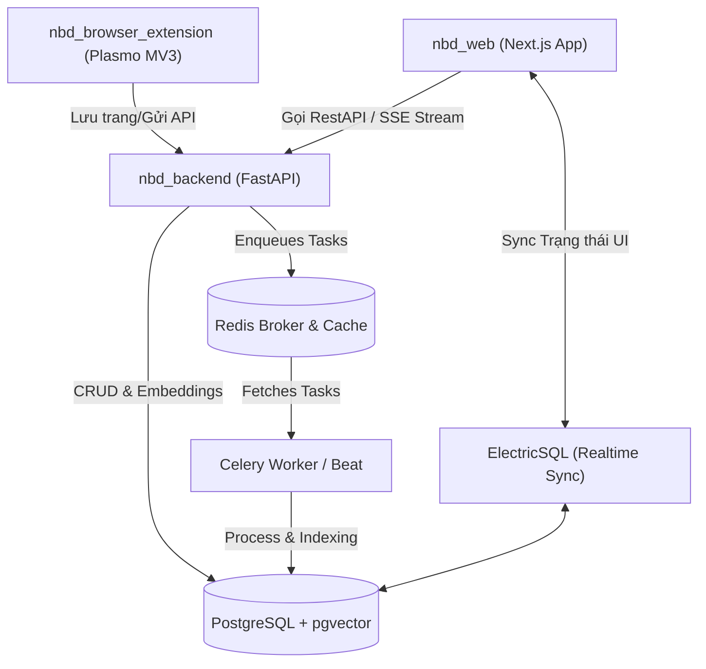

# NFD (SurfSense Fork)

**NFD** (hoặc SurfSense Fork) là một hệ thống nghiên cứu bằng tác nhân AI mạnh mẽ, kết nối các nguồn kiến thức nội bộ và bên ngoài với các mô hình ngôn ngữ lớn (LLM). Dự án cho phép người dùng và đội ngũ cộng tác, tìm kiếm nâng cao (Hybrid Search), trích dẫn nguồn tài liệu chuẩn xác theo thời gian thực. Đây là giải pháp thay thế mã nguồn mở (OSS) đầy hứa hẹn cho các công cụ như NotebookLM, Perplexity, và Glean.

---

## 🏗️ Kiến trúc Hệ thống (System Architecture)

Hệ thống được cấu trúc dạng monorepo gồm 3 thành phần chính và hạ tầng đi kèm:



### Chi tiết các thành phần:

1. **Frontend ([`nbd_web`](file:///Users/macbook/Desktop/Sales_Kyanon/NFD/nbd_web)):** Giao diện web được xây dựng bằng Next.js (App Router, Tailwind CSS, TypeScript, pnpm). Tích hợp i18n, Drizzle ORM, và xử lý stream phản hồi thời gian thực qua Server-Sent Events (SSE).
2. **Backend ([`nbd_backend`](file:///Users/macbook/Desktop/Sales_Kyanon/NFD/nbd_backend)):** FastAPI application viết bằng Python 3.12 (quản lý dependency qua `uv`). Xử lý authentication (FastAPI Users + JWT), phân quyền RBAC, tích hợp Deep Agent (LangGraph/LangChain) điều phối các tác nhân AI, thực hiện Hybrid Search (Semantic + Full Text Search) và quản lý kết nối.
3. **Celery Worker & Beat:** Xử lý các tác vụ bất đồng bộ nặng như: parse tài liệu (Docling, Unstructured, LlamaCloud), trích xuất nội dung, indexing dữ liệu vào cơ sở dữ liệu vector, gửi thông báo, tạo podcast, định kỳ đồng bộ hóa dữ liệu từ các connectors.
4. **Trình duyệt Extension ([`nbd_browser_extension`](file:///Users/macbook/Desktop/Sales_Kyanon/NFD/nbd_browser_extension)):** Browser extension viết bằng framework Plasmo (React + TypeScript), hỗ trợ lưu nhanh nội dung trang web (ngay cả các trang yêu cầu đăng nhập) thẳng vào kho kiến thức cá nhân trên NFD.
5. **Hạ tầng Docker ([`docker`](file:///Users/macbook/Desktop/Sales_Kyanon/NFD/docker)):** Cung cấp các cấu hình Docker Compose chạy toàn bộ hệ thống (`docker-compose.yml` cho Production và `docker-compose.dev.yml` cho Development).

---

## 🛠️ Công nghệ sử dụng (Tech Stack)

* **Backend & Workers:** Python 3.12, FastAPI, Celery, Redis, LiteLLM, Spacy, Chonkie, Docling/Unstructured.
* **Frontend:** Next.js 15+, Tailwind CSS 4, Drizzle ORM, pnpm, Biome (linter & formatter), Jotai.
* **Database:** PostgreSQL (with `pgvector` extension for vector embeddings).
* **Browser Extension:** Plasmo Framework, Tailwind CSS, TypeScript.

---

## 🚀 Hướng dẫn khởi chạy dưới Local (Development Setup)

### 1. Yêu cầu hệ thống (Prerequisites)
* **Docker Desktop** đã được cài đặt và đang chạy.
* **Node.js** (khuyến nghị v20+) & **pnpm** (khuyến nghị v11+).
* **Python 3.12** & **uv** (trình quản lý gói Python tốc độ cao).

---

### 2. Khởi chạy cơ sở dữ liệu & Broker (Docker Compose Dev)
Hệ thống sử dụng Docker Compose để dựng nhanh PostgreSQL, Redis và ElectricSQL.

```bash
cd docker
# Copy file môi trường mẫu và điền các giá trị cần thiết
cp .env.example .env

# Khởi chạy các dịch vụ database dưới nền
docker-compose -f docker-compose.dev.yml up -d
```

---

### 3. Cài đặt và Chạy Backend (`nbd_backend`)

1. Truy cập thư mục backend:
   ```bash
   cd ../nbd_backend
   ```
2. Tạo file `.env` từ file ví dụ:
   ```bash
   cp .env.example .env
   ```
3. Cài đặt các thư viện Python cần thiết bằng `uv`:
   ```bash
   uv sync
   ```
4. Thực hiện DB migration bằng Alembic:
   ```bash
   uv run alembic upgrade head
   ```
5. Chạy Backend API server:
   ```bash
   uv run uvicorn main:app --reload --port 8000
   ```
6. Chạy Celery Worker (ở một terminal mới):
   ```bash
   uv run celery -A app.celery_app.celery worker --loglevel=info
   ```

---

### 4. Cài đặt và Chạy Frontend (`nbd_web`)

1. Truy cập thư mục frontend:
   ```bash
   cd ../nbd_web
   ```
2. Copy file môi trường và cấu hình các biến backend URL:
   ```bash
   cp .env.example .env
   ```
3. Cài đặt các gói npm:
   ```bash
   pnpm install
   ```
4. Thực hiện đồng bộ cấu trúc database từ Drizzle ORM:
   ```bash
   pnpm db:push
   ```
5. Chạy ứng dụng Next.js ở chế độ phát triển:
   ```bash
   pnpm dev
   ```
   Ứng dụng sẽ chạy tại địa chỉ: [http://localhost:3000](http://localhost:3000)

---

### 5. Cài đặt và Chạy Extension (`nbd_browser_extension`)

1. Truy cập thư mục extension:
   ```bash
   cd ../nbd_browser_extension
   ```
2. Cài đặt dependencies:
   ```bash
   pnpm install
   ```
3. Chạy dev server của extension:
   ```bash
   pnpm dev
   ```
4. Load thư mục extension đã build vào Chrome/Firefox của bạn:
   * Trên trình duyệt Chrome, vào `chrome://extensions/`.
   * Bật **Developer mode** ở góc trên bên phải.
   * Chọn **Load unpacked** (Tải thư mục đã giải nén).
   * Chọn thư mục `build/chrome-mv3-dev` trong thư mục dự án extension.

---

## 🔄 Quy trình Tự động tạo Tag khi Push Code (CI/CD)

Dự án tích hợp cơ chế tự động tạo version tag khi push code lên nhánh chính (`main`/`dev`) có chỉnh sửa trong các thư mục `nbd_backend/**` hoặc `nbd_web/**`. 

Quy trình tự động hóa hoạt động như sau:
1. Đọc số phiên bản cơ sở từ file [pyproject.toml](file:///Users/macbook/Desktop/Sales_Kyanon/NFD/nbd_backend/pyproject.toml) (Ví dụ: `0.0.13`).
2. Tự động kiểm tra danh sách tag trên remote để tìm build number lớn nhất của phiên bản hiện tại (ví dụ: `0.0.13.5`).
3. Tăng build number lên 1 (thành `0.0.13.6`), tạo git tag mới cục bộ trên GitHub runner, và tự động `git push origin 0.0.13.6`.
4. Gắn tag này vào các Docker image được build mới nhất trên GitHub Container Registry (`ghcr.io`).
