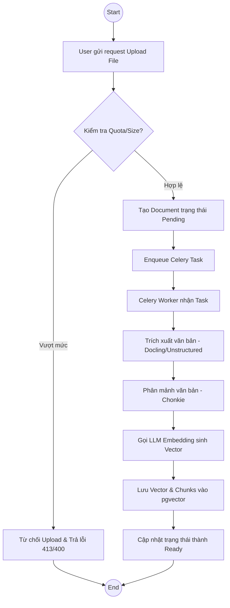
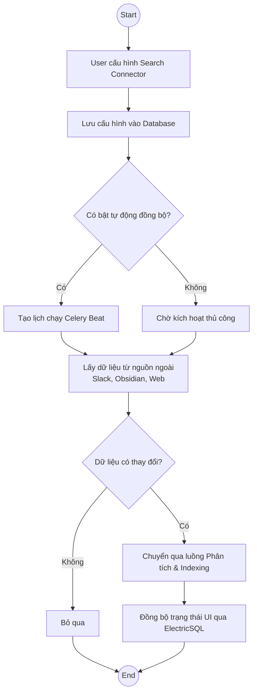
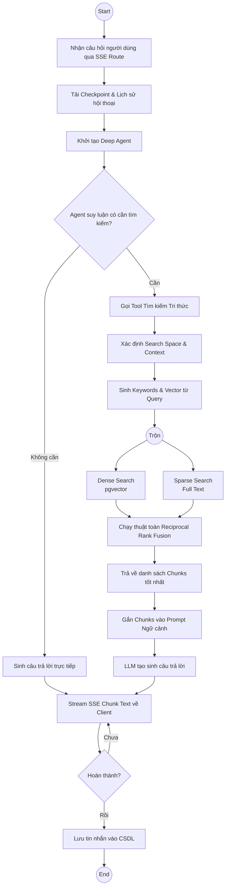

# Activity Diagram (Sơ đồ Hoạt động)

## 1. Đăng nhập (Authentication)

```mermaid
activityDiagram
    %% Syntax Mermaid cho Activity/Flowchart
    graph TD
        Start((Start)) --> InputCredentials[Nhập Email và Mật khẩu]
        InputCredentials --> SendRequest[Gửi API POST /auth/jwt/login]
        SendRequest --> CheckLimit{Kiểm tra Rate Limit IP?}
        
        CheckLimit -- Bị khóa --> ErrorLimit[Trả về 429 Too Many Requests] --> End((End))
        CheckLimit -- An toàn --> VerifyCredentials{Xác thực thông tin?}
        
        VerifyCredentials -- Sai --> ErrorInvalid[Trả về lỗi 400 Bad Request] --> End
        VerifyCredentials -- Đúng --> GenerateJWT[Tạo Access Token JWT]
        
        GenerateJWT --> ReturnToken[Trả về Token cho Client]
        ReturnToken --> SaveToken[Client lưu Bearer Token]
        SaveToken --> End
```

---

## 2. Phân tích ảnh X-quang

> **Ghi chú**: Không tìm thấy trong source. Mã nguồn không có chức năng tải và phân tích ảnh X-quang. Dưới đây là Activity Diagram thay thế cho chức năng tương đương trong hệ thống: **Quy trình Tải lên và Phân tích Tài liệu (Document Processing)**.



---

## 3. Truy xuất tri thức y khoa (Điều chỉnh thành Truy xuất tri thức đa nguồn)

> **Ghi chú**: Hệ thống NFD hỗ trợ truy xuất tri thức tổng quát dựa trên tài liệu người dùng tải lên, không giới hạn trong phạm vi y khoa.



---

## 4. Sinh giải thích bằng Hybrid RAG (Deep Agent Chat)


