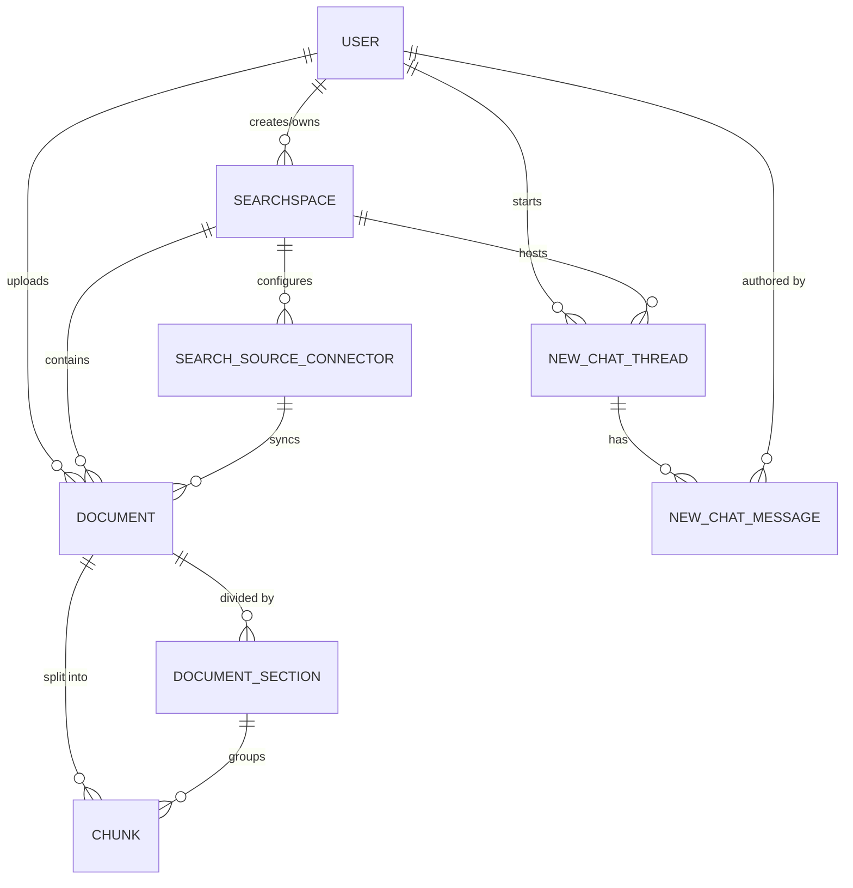

# Thiết kế Cơ sở dữ liệu (Database Design)

## 1. Phân tích Database thực tế

Hệ thống NFD (SurfSense) sử dụng PostgreSQL làm hệ quản trị cơ sở dữ liệu chính, kết hợp với extension `pgvector` để lưu trữ dữ liệu vector nhúng phục vụ thuật toán tìm kiếm (Dense Search).
Các Entity/Models được ánh xạ thông qua thư viện SQLAlchemy ORM (`nbd_backend/app/db.py`) và Drizzle ORM (Phía Frontend `nbd_web`).

---

## 2. Danh sách các bảng chính (Core Tables)

Dưới đây là đặc tả các bảng quan trọng nhất phục vụ luồng nghiệp vụ cốt lõi (User, Document, RAG, Chat).

### 2.1. Bảng `user`
Lưu trữ thông tin xác thực và hồ sơ người dùng (quản lý bởi FastAPI Users).
- `id` (UUID): Primary Key.
- `email` (String): Unique, thông tin đăng nhập.
- `hashed_password` (String): Mật khẩu đã mã hoá.
- `is_active` (Boolean): Trạng thái hoạt động.

### 2.2. Bảng `searchspaces`
Không gian tìm kiếm, đại diện cho một dự án, thư mục hoặc không gian làm việc chia sẻ.
- `id` (Integer): Primary Key.
- `name` (String): Tên không gian tìm kiếm.
- `created_by_id` (UUID): Foreign Key (User).
- `created_at` (Timestamp): Thời gian tạo.

### 2.3. Bảng `documents`
Lưu trữ thông tin siêu dữ liệu (Metadata) và nội dung của các tài liệu được tải lên/đồng bộ.
- `id` (Integer): Primary Key.
- `title` (String): Tiêu đề tài liệu.
- `document_type` (Enum): Loại (FILE, EXTENSION, OBSIDIAN_CONNECTOR, v.v.).
- `content` (Text): Nội dung văn bản thô.
- `embedding` (Vector): Vector nhúng đại diện cho toàn bộ tài liệu.
- `status` (JSONB): Trạng thái xử lý (Pending, Processing, Ready, Failed).
- `search_space_id` (Integer): Foreign Key (SearchSpace).
- `connector_id` (Integer): Foreign Key (SearchSourceConnector) - nullable.
- `created_by_id` (UUID): Foreign Key (User).

### 2.4. Bảng `chunks`
Phân mảnh văn bản từ các `documents` phục vụ Hybrid Search và nhúng Vector chi tiết.
- `id` (Integer): Primary Key.
- `document_id` (Integer): Foreign Key (Document).
- `content` (Text): Nội dung phân mảnh.
- `embedding` (Vector): Vector nhúng của chunk.
- `section_id` (UUID): Foreign Key (DocumentSection).

### 2.5. Bảng `search_source_connectors`
Cấu hình kết nối đến các nguồn tài liệu ngoại vi (Obsidian, Google Drive, MCP...).
- `id` (Integer): Primary Key.
- `connector_type` (Enum): Loại kết nối.
- `config` (JSONB): Cấu hình bảo mật/token/path.
- `search_space_id` (Integer): Foreign Key (SearchSpace).

### 2.6. Bảng `new_chat_threads`
Quản lý các luồng hội thoại giữa người dùng và Deep Agent AI.
- `id` (Integer): Primary Key.
- `title` (String): Tiêu đề hội thoại.
- `visibility` (Enum): Quyền hiển thị (PRIVATE, SEARCH_SPACE).
- `search_space_id` (Integer): Foreign Key (SearchSpace).
- `created_by_id` (UUID): Foreign Key (User).

### 2.7. Bảng `new_chat_messages`
Lưu chi tiết từng tin nhắn trong hội thoại.
- `id` (Integer): Primary Key.
- `thread_id` (Integer): Foreign Key (NewChatThread).
- `role` (Enum): Vai trò (user, assistant, system).
- `content` (JSONB): Nội dung tin nhắn và cấu trúc Tool Calls.
- `author_id` (UUID): Foreign Key (User).

---

## 3. Quan hệ giữa các bảng (Entity-Relationship Diagram)

Sơ đồ ERD thể hiện mối liên kết cốt lõi của hệ thống (User -> SearchSpace -> Document/Chat -> Chunks).

---

## 4. Data Flow (Luồng Dữ liệu)

Dưới đây là mô tả đường đi của dữ liệu từ khi tiếp nhận đến lúc phân tích và lưu trữ.

1. **Ingestion (Tiếp nhận):**
   - User tải lên File hoặc dùng Extension lưu nội dung Web.
   - Dữ liệu thô truyền đến Backend API (FastAPI).
   - Backend ghi bản ghi tạm vào bảng `documents` với trạng thái `Pending`.
   
2. **Processing (Xử lý bất đồng bộ):**
   - Celery Worker nhận tín hiệu.
   - Trích xuất nội dung bằng Document Parsers -> Lưu Text vào `documents.content`.
   - Phân mảnh nội dung thành các bản ghi `chunks` -> Lưu Text vào `chunks.content`.
   
3. **Embedding (Vector hóa):**
   - Worker gọi LiteLLM Embedding API.
   - Lưu trữ mảng float multidimensional vào cột `embedding` kiểu Vector của bảng `chunks` (và `documents`).
   - Cập nhật trạng thái `documents.status` = `Ready`.
   
4. **Retrieval (Trích xuất):**
   - User chat, Deep Agent phân tích ý định.
   - Deep Agent thực thi Hybrid Search truy vấn trực tiếp vào bảng `chunks` (Cosine Similarity trên cột Vector + Full-Text Search trên cột Content).
   - Kết quả được RRF chọn lọc và kết xuất thành Text Context đẩy vào Prompt cho LLM sinh câu trả lời.
