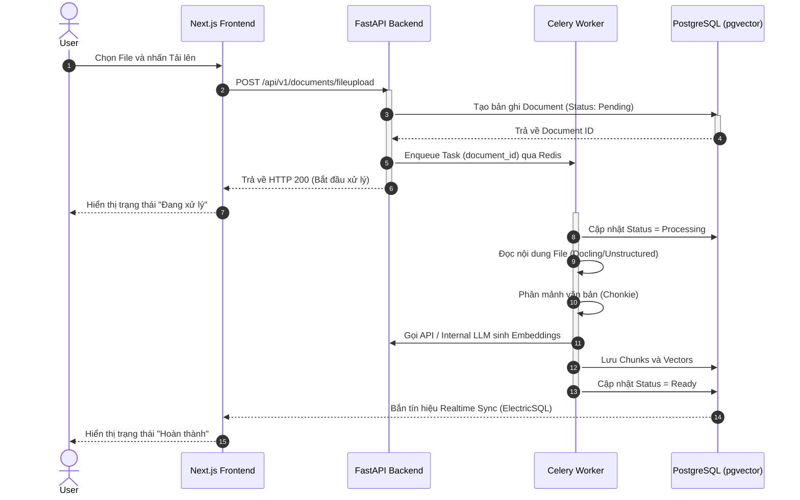
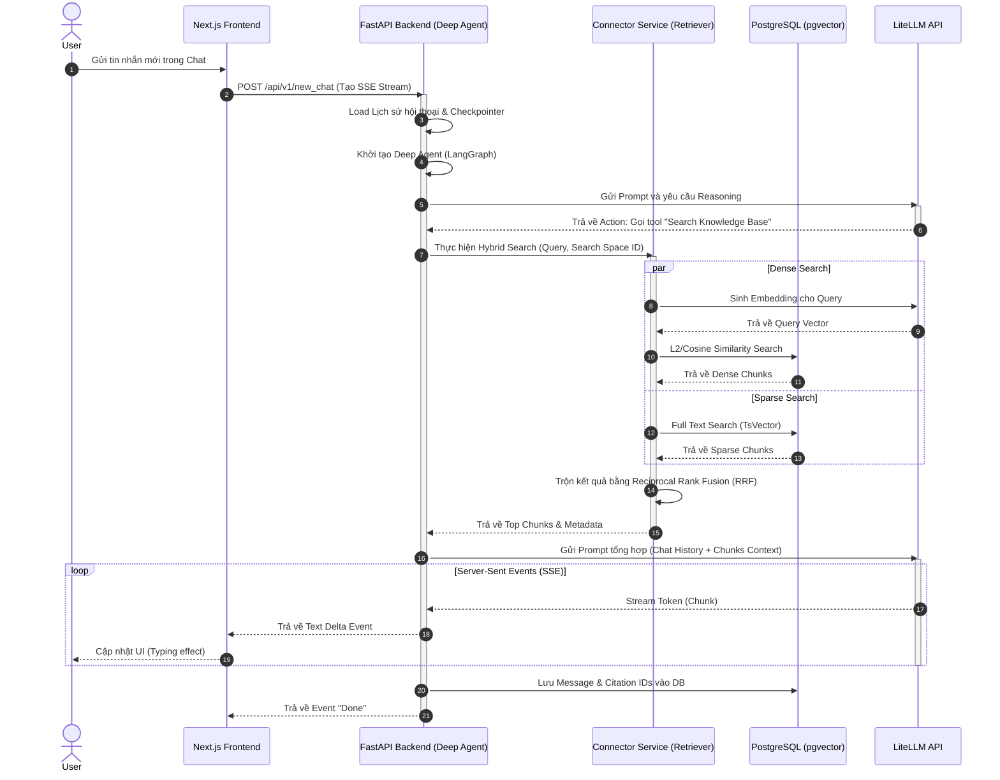
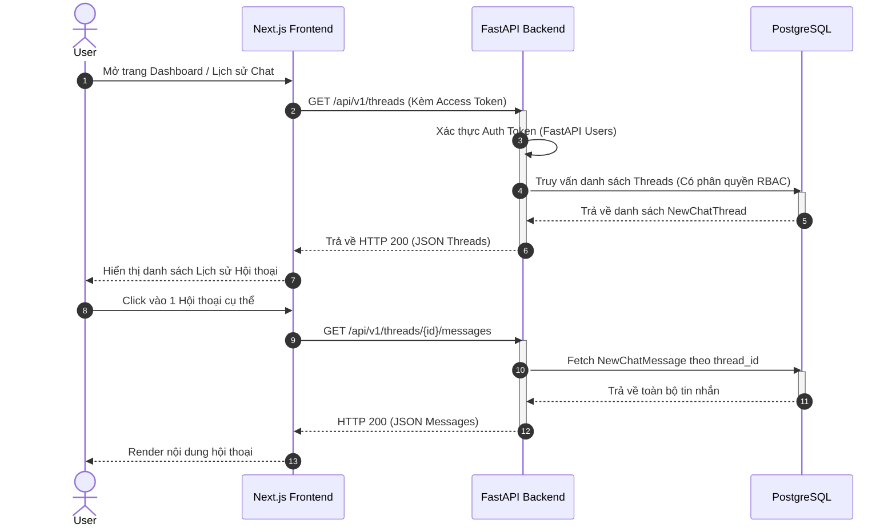

# Sequence Diagram (Biểu đồ Tuần tự)

## 1. Upload và Phân tích Tài liệu (Thay thế cho Upload và Phân tích ảnh)

> **Ghi chú**: Chức năng phân tích ảnh và Vision Service không tìm thấy trong source. Dưới đây là sơ đồ mô tả quá trình tải lên tài liệu (File, Web) và xử lý bất đồng bộ thông qua Celery Worker để trích xuất văn bản thay cho luồng xử lý ảnh.

---

## 2. Hybrid RAG Query

Sơ đồ thể hiện quá trình người dùng đặt câu hỏi, tác nhân Deep Agent quyết định tìm kiếm (Retriever), thực hiện Hybrid Search (Dense + Sparse) và hợp nhất bằng RRF, cuối cùng trả kết quả về qua luồng SSE.

---

## 3. Xem lịch sử hội thoại (Thay thế cho Xem lịch sử phân tích ảnh)

