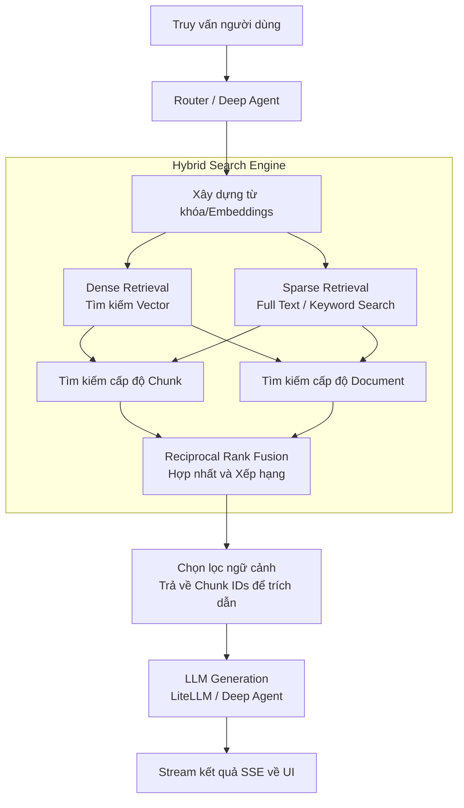

# Chương 2: Phân tích thiết kế hệ thống

## 1. Mô tả tổng quan hệ thống

**Mục tiêu hệ thống:**
Dự án NFD (SurfSense Fork) là một hệ thống Personal Knowledge Management (Quản trị tri thức cá nhân) được tích hợp sức mạnh của tác nhân AI (AI Agent). Hệ thống nhằm mục đích giúp người dùng lưu trữ, đồng bộ, và tìm kiếm thông tin từ nhiều nguồn tài liệu khác nhau (File cục bộ, Trình duyệt web, Obsidian, Google Drive...) và cung cấp khả năng tương tác, truy vấn thông minh thông qua các mô hình ngôn ngữ lớn (LLM).

**Chức năng chính:**
- Quản lý Search Space (không gian tìm kiếm) và cấp quyền truy cập linh hoạt (Role-Based Access Control).
- Quản lý Connectors để kết nối các nguồn kiến thức ngoài (như Obsidian, Google Drive, Web Extensions).
- Quản lý Documents (Tải lên, trích xuất văn bản, chunking, nhúng - embedding).
- Thực hiện Hybrid Search (kết hợp Semantic Search và Keyword Search) bằng cơ chế Reciprocal Rank Fusion (RRF).
- Cung cấp giao diện Chat AI dựa trên Deep Agent (LangGraph/LangChain) hỗ trợ theo dõi suy luận (reasoning), streaming thời gian thực, và gọi các công cụ tự động (tooling).

**Các thành phần chính:**
- **Frontend (Web Application)**: Giao diện tương tác người dùng xây dựng bằng Next.js.
- **Backend (API Service)**: Xử lý logic nghiệp vụ, quản lý agent, auth, viết bằng FastAPI (Python).
- **Trình duyệt Extension**: Plasmo extension hỗ trợ lưu trữ nhanh trang web vào cơ sở dữ liệu tri thức.
- **Async Workers**: Hệ thống xử lý tác vụ nền bằng Celery và Redis cho các luồng tải file, nhúng dữ liệu.
- **Database & Vector Store**: PostgreSQL với phần mở rộng pgvector lưu trữ cả dữ liệu quan hệ và vector nhúng.
- **ElectricSQL**: Hỗ trợ đồng bộ hóa trạng thái giao diện theo thời gian thực (Realtime Sync).

---

## 2. Kiến trúc tổng thể

Hệ thống được thiết kế theo mô hình client-server kết hợp với kiến trúc xử lý bất đồng bộ cho các luồng xử lý AI/Data nặng.

```mermaid
graph TD
    %% Client Layer
    subgraph Client Layer
        Web[Frontend: nbd_web\nNext.js App]
        Ext[Browser Ext: nbd_browser_extension\nPlasmo MV3]
    end
    
    %% API & Sync Layer
    subgraph API & Sync Layer
        Backend[Backend: nbd_backend\nFastAPI Python 3.12]
        Electric[ElectricSQL\nRealtime Sync]
    end
    
    %% Processing Layer
    subgraph Async Processing
        Broker[(Redis\nBroker & Cache)]
        Worker[Celery Worker\nData Parsing & Indexing]
    end
    
    %% AI & Models Layer
    subgraph AI & Retrieval Layer
        DeepAgent[Deep Agent\nLangGraph / LiteLLM]
        Tooling[Tool Registry\nScraper, Podcast...]
        HybridSearch[Hybrid Retriever\nDense + Sparse]
    end
    
    %% Storage Layer
    subgraph Storage Layer
        Postgres[(PostgreSQL + pgvector\nRelational & Vector DB)]
    end

    %% Interactions
    Web -- "REST API / SSE Stream" --> Backend
    Ext -- "Lưu trang web" --> Backend
    Web <.. "Sync Trạng thái UI" ..> Electric
    Electric <--> Postgres
    
    Backend -- "Phân quyền & Lịch sử" --> Postgres
    Backend -- "Đẩy tác vụ xử lý File" --> Broker
    Broker -- "Lấy tác vụ" --> Worker
    Worker -- "Ghi Chunks/Embeddings" --> Postgres
    
    Backend -- "Chat Request" --> DeepAgent
    DeepAgent -- "Sử dụng" --> Tooling
    DeepAgent -- "Truy xuất ngữ cảnh" --> HybridSearch
    HybridSearch -- "Vector & Text Search" --> Postgres
```

---

## 3. Luồng phân tích ảnh X-quang

> **Ghi chú**: Không tìm thấy trong source.  
*Giải thích*: Source code hiện tại của dự án NFD không chứa các mô-đun, hàm hay AI pipeline liên quan đến xử lý hình ảnh y tế hay phân tích ảnh X-quang. Hệ thống hoàn toàn tập trung vào phân tích, trích xuất và truy xuất văn bản (Text/Document) cho mục đích hỏi đáp (Q&A) và lưu trữ tri thức.

---

## 4. Luồng Hybrid RAG

Trong dự án NFD, luồng truy xuất tri thức dựa trên sự kết hợp giữa kỹ thuật Hybrid Search (Dense + Sparse) ở cả mức độ Document và Chunk, sau đó sử dụng Reciprocal Rank Fusion (RRF) để kết hợp các kết quả lại.



---

## 5. Thành phần AI

Dựa trên mã nguồn thực tế của hệ thống, các thành phần AI được sử dụng bao gồm:

- **Deep Agent (LangGraph)**: Khung điều phối agent có stateful (checkpointer), đóng vai trò điều khiển logic suy luận (reasoning) của bot trước khi gọi các tool.
- **LiteLLM / Model Router**: Nền tảng trung gian hỗ trợ kết nối với nhiều nhà cung cấp LLM khác nhau (OpenAI, Anthropic, Google, v.v.).
- **Chonkie / Docling / Unstructured**: Các công cụ phục vụ trích xuất nội dung văn bản (OCR, parsing) và phân chia tài liệu (Chunking) trước khi đưa vào CSDL.
- **Embedding Model (LiteLLM)**: Mô hình tạo vector nhúng đa chiều cho các đoạn văn bản (chunks).
- **EfficientNetV2, Swin Tiny, SimCLR, Ensemble, Calibration, Eigen-CAM**: Không tìm thấy trong source. Dự án không sử dụng các mô hình thị giác máy tính hay các kỹ thuật sinh Class Activation Mapping (CAM).

---

## 6. Thành phần RAG

- **Embedding Model**: Được quản lý thông qua cấu hình toàn cục hoặc theo từng Search Space, thông qua LiteLLM để gọi các API Embedding tương ứng (vd: OpenAI `text-embedding-3-small`).
- **Chunking Strategy**: Sử dụng các thư viện như `Chonkie` và `Docling` để phân rã (chunk) tài liệu theo cấu trúc ngữ nghĩa hoặc kích thước token nhất định.
- **Vector Database**: PostgreSQL kết hợp với thư viện mở rộng `pgvector` phục vụ lưu trữ trực tiếp vector bên cạnh dữ liệu quan hệ.
- **Dense Retrieval**: Truy xuất dựa trên độ tương đồng (Cosine similarity / L2 distance) của các vector.
- **Sparse Retrieval**: Phục vụ tìm kiếm theo từ khóa (Full-Text Search).
- **RRF (Reciprocal Rank Fusion)**: Thuật toán dung hòa kết quả xếp hạng giữa Dense và Sparse search, đảm bảo kết quả có ý nghĩa ngữ nghĩa nhưng không bị trượt các từ khóa chính xác.
- **LLM**: Các mô hình tạo sinh nội dung ngôn ngữ tự nhiên, được gắn vào agent để sinh ra câu trả lời cho người dùng cuối.

---

## 7. Kết luận chương

Hệ thống NFD sử dụng kiến trúc AI Agent linh hoạt kết hợp với mô hình RAG tiên tiến (Hybrid Search + RRF). Dù không tập trung vào luồng xử lý hình ảnh phức tạp, hệ thống lại thể hiện sức mạnh thông qua các quy trình phân tích và đồng bộ tài liệu liên tục từ nhiều nguồn đa dạng. Hệ thống đảm bảo được tính mở rộng cao và trải nghiệm người dùng theo thời gian thực dựa vào Celery worker, SSE Streaming và ElectricSQL.
